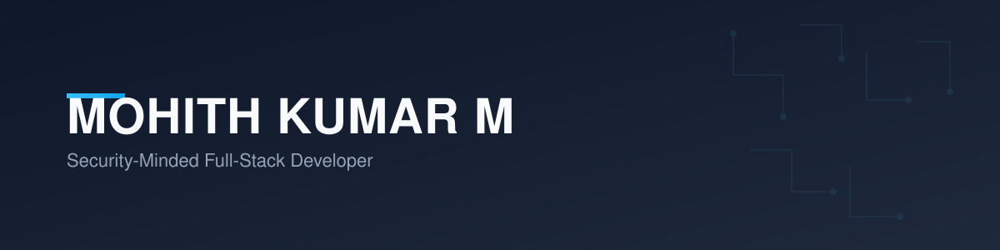

Security-minded full-stack developer. Final-year Information Science and Engineering student at JSS Academy of Technical Education, Bengaluru.

Currently building **Property Wallet**, a production proptech/fintech application, during a full-time engineering internship. Background includes federated learning security research and three national hackathon wins.

## Focus Areas

- Full-stack application development (React Native, Spring Boot, Node.js)
- Application security — mobile and web pentesting, secure auth/payment flows
- Cloud infrastructure on AWS and Cloudflare
- Federated learning and applied ML for intrusion detection

## Tech Stack

**Languages**

**Frontend**

**Backend**

**Cloud & Infrastructure**

**Databases**

**Security Tooling**

**ML / Data**

**Tools**

## Selected Projects

**Property Wallet** — Production proptech application. Full-stack build and deployment, including a six-phase security pentest (mobile static/dynamic analysis, cloud configuration review, business logic testing) with real vulnerabilities identified and remediated.

**Agentic FedGrid** — Federated intrusion detection system combining a Tabular Transformer and XGBoost ensemble, trained across distributed nodes with Flower/FedAvg on the CICIDS2017 dataset. 94%+ accuracy. Final-year project.

**KSP-DATATHON — Conversational Crime Intelligence** — RAG-based investigator decision-support tool built on Zoho Catalyst, with strict guardrails against demographic bias in model features. Team hackathon project.

## Contact

- Portfolio: [mohithkumar.dev](https://mohithkumar.dev)
- LinkedIn: [linkedin.com/in/mkm15](https://linkedin.com/in/mkm15/)
- Email: 1725mohith@gmail.com
